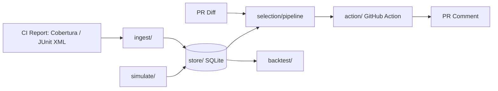
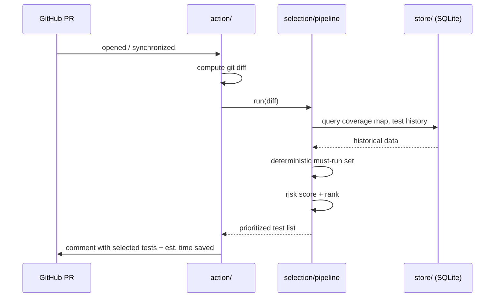

# Architecture — Winnow

Rationale for *why* these decisions were made lives in
[docs/superpowers/specs/2026-08-21-winnow-design.md](superpowers/specs/2026-08-21-winnow-design.md).
This file describes the current structure.

## Style

Monolith-first, single Python package (`winnow/`), layered by responsibility.
No microservices — the whole system runs as one process, either as a CLI or
inside a GitHub Action.

## Module layout

```
winnow/
├── ingest/          # Adapter: normalizes coverage/test-result formats
│   ├── base.py      # abstract interface -> normalized model
│   ├── cobertura.py
│   └── junit.py
├── store/           # Repository: isolates SQLite from callers
│   ├── repository.py   # CommitRepository, CoverageRepository, TestOutcomeRepository
│   └── schema.py
├── selection/        # Core algorithm
│   ├── deterministic.py   # coverage-overlap "must-run" set
│   ├── risk_scorer.py     # Strategy: pluggable scoring model
│   └── pipeline.py        # orchestrates deterministic + risk_scorer
├── simulate/         # Synthetic data generator (bootstrap phase)
├── backtest/         # Historical PR replay + precision/recall report
└── action/           # GitHub Action entrypoint, PR comment formatting
```

## Dependency direction

```
action → selection → store → ingest
```

Outer, application-specific layers depend on inner, core layers — never the
reverse. `selection/` has no knowledge of GitHub; it can be driven from a
CLI, a different CI system, or a test harness without modification.

## Patterns

- **Adapter** (`ingest/`) — Cobertura and JUnit XML have different shapes.
  Each adapter converts its format into a shared `NormalizedCoverage` /
  `NormalizedTestResult` model, so `store` and `selection` never see raw XML.
  Adding a new format (e.g. LCOV) means adding one adapter.
- **Repository** (`store/`) — callers use methods like
  `CommitRepository.get_recent(n)` instead of writing SQL directly. If the
  store ever moved off SQLite, only this layer would change.
- **Strategy** (`selection/risk_scorer.py`) — the risk-scoring model
  (gradient boosting, logistic regression, or a future alternative) sits
  behind one interface, so backtesting can compare strategies directly.
- **Pipeline** (`selection/pipeline.py`) — deterministic selection, risk
  scoring, and threshold application run as an ordered, independently
  testable chain.

## Component diagram



## Sequence — PR flow



## Tech stack decision log

| Layer | Choice | Why | Rejected alternative |
|---|---|---|---|
| Language | Python 3.12 | Mature coverage/JUnit XML parser ecosystem, scikit-learn fits naturally, fast to prototype | Go (faster, but weak ML libraries), TypeScript (coverage format support more fragmented) |
| Data store | SQLite (file-based) | Enough for single-repo scale, works inside a GitHub Action with no extra infra | PostgreSQL (unnecessary operational overhead — a separate server) |
| Diff/git access | GitPython | Mature, well-documented diff parsing | Writing our own git-diff parser (violates §0.4 — solved problem) |
| Coverage parsing | `coverage.py` native + Cobertura XML fallback | Native for Python projects; Cobertura is the cross-language industry standard | Inventing a custom coverage format (never justified) |
| Test result parsing | `junitparser` | JUnit XML is the de facto standard (pytest, JUnit, Jest all emit it) | — |
| ML layer | scikit-learn (GradientBoostingClassifier or LogisticRegression) | Interpretable on small datasets, not heavyweight, `feature_importances_` gives explainability | XGBoost/LightGBM (unnecessary weight for this data size), deep learning (clearly overkill) |
| Deployment | GitHub Actions (composite action, Python entrypoint) | Target is already CI integration | A standalone web service (unjustified operational overhead at this scale) |

## Config variables

`WINNOW_DB_PATH`, `WINNOW_COVERAGE_FORMAT` (`cobertura`\|`coverage-py`),
`WINNOW_RISK_THRESHOLD`, `WINNOW_MODE` (`bootstrap`\|`backtest`\|`live`) —
see `.env.example` for defaults.
