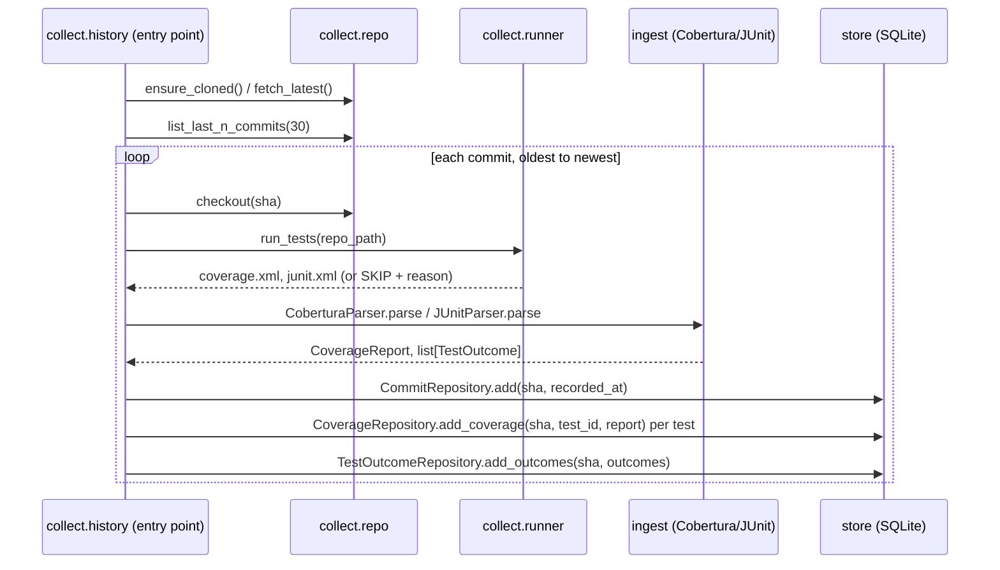

# History Collector — Design Spec

**Date:** 2026-08-21
**Status:** Approved, pre-implementation
**Scope:** First of four follow-up sub-systems (collection → mutation-based ground truth →
ML risk scorer → GitHub Action). This spec covers collection only.

## Problem

The core engine (see [2026-08-21-winnow-design.md](2026-08-21-winnow-design.md)) was
validated entirely with synthetic data. The risk scorer and any future backtesting need
real churn, failure-rate, and co-change signal from an actual project's commit history —
none exists yet.

## Target repository

`gvergnaud/ts-pattern` — chosen over two earlier candidates (`colinhacks/zod`,
`date-fns/date-fns`) after live verification showed both were pnpm monorepos with
workspace dependencies and, in zod's case, custom module-resolution conditions across
multiple internal API versions (v3/v4/v4-mini) — too fragile for a harness that
re-installs and re-runs the suite at 30 different historical commits. ts-pattern is a
single-package TypeScript library (`"test": "jest"`, ts-jest, no workspace), verified via
its `package.json` on GitHub, and self-contained (pattern matching — no network/database
dependencies in its tests).

## Requirements

**Functional**
- Clone `ts-pattern` into `data/ts-pattern/` if absent; otherwise fetch and reset to the
  latest `main`.
- Walk the last 30 commits on `main` (oldest to newest, so `CommitRepository.get_recent`
  ordering matches real chronology).
- Per commit: checkout, `npm ci`, run the test suite with coverage (Cobertura XML) and
  test results (JUnit XML) reporters.
- Ingest both reports through the existing `CoberturaParser` and `JUnitParser` (Tasks 4–5
  of the core engine — unmodified) into `CommitRepository`, `CoverageRepository`,
  `TestOutcomeRepository`.
- Skip and log (never crash the whole run) any commit where `npm ci` or the test suite
  fails to complete — partial history is an acceptable outcome for 1-2 bad commits out of
  30; note the SKIP_LOG format below.

**Non-functional**
- No modification to ts-pattern's own `package.json` / lockfile (clean checkout must stay
  reproducible across runs — `npm ci --no-save` semantics, never `npm install --save`).
- Coverage/reporter tooling installed once, not per-commit, to keep a 30-commit run in the
  range of minutes rather than tens of minutes.
- Every collector module ships with a unit test; the one real-clone integration test is
  explicitly marked slow/manual (not part of the default `pytest` run) since it needs
  network access and `npm`/`node` on the host.

**Business**
- Purpose: unblock the ML risk scorer and mutation-based backtesting sub-systems, which
  both consume this data — this sub-system produces no user-visible feature on its own.

## Build vs. buy

- **Cobertura/JUnit reporting**: Jest's built-in `coverageReporters` accepts any
  `istanbul-reports` reporter name, including `"cobertura"` — no plugin needed. Test
  results: `jest-junit` (mature, widely used community package) — not written from
  scratch.
- **Cloning/checkout**: plain `git` via `subprocess`, matching the project's existing
  no-new-dependency discipline (`GitPython` was named in the original spec's tech-stack
  table but is not yet used anywhere in the codebase; introducing it here for a handful of
  `clone`/`checkout`/`log` calls is not justified over `subprocess` + the `git` binary
  already required on the host to run `npm ci` against a checked-out tree).
- **jest-junit placement**: installed once as a devDependency of a small Node.js helper
  under `tools/jest-reporters/` in the winnow repo (own `package.json`), referenced from
  each ts-pattern checkout via an absolute `--reporters` path — avoids touching
  ts-pattern's `node_modules`/lockfile and avoids a 30x reinstall.

## Architecture

New package `winnow/collect/`, sibling to `ingest`/`store`/`selection`/`simulate`:

```
winnow/collect/
├── __init__.py
├── repo.py          # clone/fetch/checkout via subprocess+git
├── runner.py         # npm ci + jest invocation, writes coverage/junit XML to a temp dir
└── history.py         # orchestrates: for each commit -> runner -> ingest -> store
tools/jest-reporters/
├── package.json      # devDependency: jest-junit
└── node_modules/      # installed once, gitignored
```

Dependency direction: `collect` depends on `store` and `ingest` (both already exist) —
never the reverse. `collect` has no knowledge of `selection` or the future ML scorer; it
only produces rows in the same SQLite schema the core engine already reads from.

### Sequence



## Error handling

- `runner.run_tests` returns a result type (`RunResult`) with either the two report paths
  or a `skipped: True, reason: str` — `history.py` logs the skip (`SKIP_LOG` line: commit
  sha, short reason) and continues to the next commit. No exception propagates past a
  single commit's failure.
- A totally unreachable repo (clone/fetch fails) is a hard stop — that is not a per-commit
  condition, it means the whole run has nothing to do.

## Testing strategy

- `collect.repo`: unit-tested against a local throwaway git repo created in `tmp_path`
  (real `git init`/`commit`/`checkout` calls, no network) — same "real behavior, not
  mocks" discipline as the rest of the codebase.
- `collect.runner`: unit-tested with a fixture Node project (a trivial `package.json` +
  one passing/one failing Jest test) checked into `tests/fixtures/` — proves the
  coverage/junit reporter wiring works without touching the real ts-pattern clone.
- `collect.history`: unit-tested with fakes for `repo`/`runner` (both are small, seam-y
  interfaces) verifying the per-commit orchestration and skip-and-continue behavior.
- One `tests/collect/test_integration_ts_pattern.py`, marked with a custom pytest marker
  (`@pytest.mark.slow`) and excluded from the default run via `pytest.ini` /
  `pyproject.toml` `addopts = "-m 'not slow'"` — clones the real ts-pattern repo and
  collects 2 real commits (not 30, to keep manual runs fast) end to end, then asserts rows
  landed in the store. Run explicitly with `pytest -m slow`.

## Open questions for the next sub-systems (not this plan)

- Mutation-based ground truth (`winnow/backtest/`) will run Stryker against whichever
  commit's checkout is left on disk after this collector's last iteration — needs its own
  design pass once this lands.
- The ML risk scorer's exact feature set (churn window size, co-change definition) is
  deferred until real data from this collector is available to inspect.
